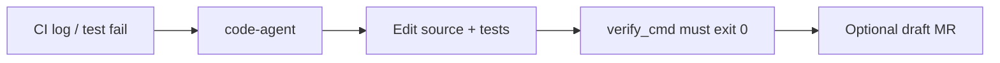

# Kramlipi Docs

## What is `code-agent`?

**`code-agent`** is a terminal CLI that reads your **git repo**, uses AI + real tools to edit code, runs a **verify command** to prove the fix works, and optionally opens a **draft merge request**.

Use it in **CI and local development** when you need to:

| Problem | What code-agent does |
|---------|----------------------|
| **CI pipeline failed** | Reads the build log → finds root cause → fixes code → re-runs your verify command |
| **Failing unit tests** | Fixes Python (`pytest`), Go (`go test`), Rust, TypeScript, and more from test output |
| **Low code coverage** | Adds missing unit tests for uncovered lines (does **not** delete code to cheat coverage) |
| **Missing unit tests** | Writes new tests under `tests/` for code paths that have no coverage |
| **Flaky / repeated CI failures** | Parses failure logs + git diff + run history (RCA); deduplicates same failure within 24h |
| **Slow CI (“run everything”)** | `test-intel` expert: git diff → run only impacted tests |
| **Missing telemetry / metrics** | `monitoring-expert` scans repo → finds handlers without Prometheus/OpenTelemetry metrics |
| **Open MR for telemetry gaps** | Run monitoring expert with `--publish` → draft PR with instrumentation fixes |



!!! tip "Start here"
    Never used it before? Go to **[Quick Start →](kramlipi-ai-code-agent/quick-start.md)**

---

## Quick commands (copy-paste)

```bash
# 1) Install (creates the code-agent binary in your venv)
git clone https://github.com/kramlipi/ai-code-agent.git
cd ai-code-agent && python3 -m venv .venv && source .venv/bin/activate
pip install -e ".[dev]"

# 2) API key
export GEMINI_API_KEY="your-google-ai-studio-key"

# 3) Check it works
code-agent doctor

# 4) Smallest example — fix one thing in your repo
code-agent run "Add a docstring to README" -w /path/to/your-repo

# 5) Fix failing Python tests in a git repo
pytest -q 2>&1 | tee /tmp/ci.log
code-agent experts run bug-fix --log /tmp/ci.log --verify-cmd "pytest -q" -w /path/to/your-repo

# 6) Raise coverage (add missing unit tests)
pytest -q --cov=my_pkg --cov-fail-under=80 2>&1 | tee /tmp/cov.log
code-agent experts run bug-fix --log /tmp/cov.log --verify-cmd "pytest -q --cov=my_pkg --cov-fail-under=80" -w /path/to/your-repo

# 7) Find missing telemetry + open draft MR
code-agent experts run monitoring-expert --publish -w /path/to/your-repo
```

---

## Projects

| Project | What it is | Docs |
|---------|------------|------|
| [**Kramlipi AI Code Agent**](kramlipi-ai-code-agent/index.md) | Headless CI + test + telemetry automation CLI | [Quick Start](kramlipi-ai-code-agent/quick-start.md) |

### Language examples

| Language | Guide |
|----------|--------|
| Python | [Failing pytest example](kramlipi-ai-code-agent/examples/python.md) |
| Go | [Failing `go test` example](kramlipi-ai-code-agent/examples/go.md) |
| Java | [Failing JUnit example](kramlipi-ai-code-agent/examples/java.md) |

---

## How verify works (why this is safe for CI)

The agent **cannot claim success** unless your command passes:

```bash
--verify-cmd "pytest -q"
```

| Exit code | Meaning |
|-----------|---------|
| `0` | Tests passed — fix accepted |
| `2` | Agent ran but verify failed — fix rejected |

The agent also **refuses** to edit `.github/workflows/**` to make CI green by cheating.

---

## Experts (automation modes)

| Expert | Use when |
|--------|----------|
| `bug-fix` | CI log has test/compiler/coverage errors |
| `test-intel` | PR CI is slow — run only impacted tests |
| `monitoring-expert` | Missing metrics / bad alert rules → optional MR |
| `deploy-guard` | Post-deploy metrics check |
| `sre-expert` | Alert JSON from Alertmanager |

Full reference: [Experts](kramlipi-ai-code-agent/experts.md)

---

## Site info

- **Live docs:** [https://kramlipi.github.io/](https://kramlipi.github.io/)
- **Source:** [github.com/kramlipi/kramlipi.github.io](https://github.com/kramlipi/kramlipi.github.io)
