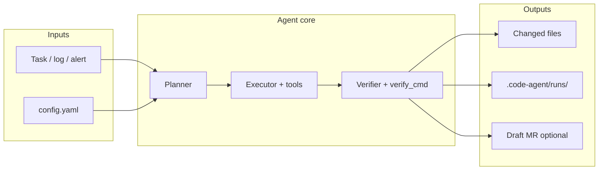

# Kramlipi AI Code Agent

**Kramlipi AI Code Agent** (`code-agent`) is a headless coding CLI that:

- Reads and edits your repo with real tools (`read_file`, `write_file`, `ast_edit`, `search_code`)
- Runs a **plan → execute → verify** loop (LangGraph)
- Calls LLMs via **LiteLLM** (Gemini, OpenAI, Anthropic, Ollama, …)
- Ships **automation experts** for CI failures, test selection, deploy guard, SRE alerts, and monitoring audits

!!! info "Source repository"
    Product source: [ai-code-agent](https://github.com/kramlipi/ai-code-agent) (install from that repo).

## Architecture

## What it is / is not

| | |
|---|---|
| **Is** | Terminal CLI for automated fixes, test intel, SRE/monitoring experts |
| **Is not** | Cursor IDE, a PR review bot, or a flaky-test analytics platform |
| **Verify gate** | `verify_cmd` must exit `0` — subprocess beats LLM claims |
| **Safety** | Will **not** edit `.github/workflows/**` to mask failures |

## Experts at a glance

| Expert | One-line purpose |
|--------|------------------|
| `bug-fix` | CI log → RCA → fix → optional draft MR |
| `test-intel` | Git diff → impacted tests + shard plan |
| `deploy-guard` | Metrics vs baseline → pass / block / rollback |
| `sre-expert` | Alert JSON → reliability fix |
| `monitoring-expert` | Repo scan → missing metrics / bad rules |

## Next steps

- [Quick Start](quick-start.md) — install, doctor, first command
- [Commands](commands.md) — full CLI reference
- [Recipes](recipes.md) — copy-paste workflows for Python, Go, CI logs
